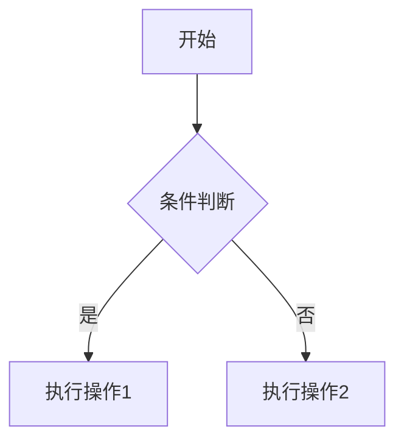

## 表情包链接
- 💘[Markdown Emojis](https://github.com/ikatyang/emoji-cheat-sheet)💘

## 目录写法（更多使用方法询问AI)
- [一、格式](#基本格式)
- [二、表格](#二表格)

```markdown
- [一、代码块](#一代码块)
- [二、表格](#二表格)
```
---
## 一、基本格式
### 1. 标题层级 - 以#号标记
```markdown
# 一级标题（等价于HTML的<h1>）
## 二级标题
### 三级标题（建议最多用到这一级）
#### 四级标题（慎用，可能影响SEO）
```

---

### 2. 特殊符号演示
- 如何转义\#号
- 价格对比：\$100 vs \$200
  
```markdown
- 如何转义\#号
- 价格对比：\$100 vs \$200
```

---

### 3. 段落与换行
末尾需要**空两格**再换行（兼容性更好）  
这是第二段，直接空一行更清晰。

---

### 4. 强调与分割
如果需要强制换行，在行尾加两个空格。

---

### 5. 分割线
- 用三个减号（上下空行）

---

### 6. 链接效果
- [示例文件下载](./demo.zip)  
- [外部链接](https://example.com)

```markdown
  - [示例文件下载](./demo.zip)  
  - [外部链接](https://example.com)
```

---

### 7. 缩进符
- 用`>`符号前置，缩进段落

---

### 8. 折叠内容（GitHub风格）
<details>
<summary>点击展开详细步骤</summary>
1. 隐藏内容1  
2. 隐藏内容2
</details>
```markdown
<details>
<summary>点击展开详细步骤</summary>
1. 第一步  
2. 第二步
</details>
```

---

### 9. 注释写法（不会渲染）
```markdown
[//]: # (这是单行注释，不会显示在渲染结果中)
[comment]: # (多行注释写法兼容性更好)
```

---

### 10. 徽章标签（GitHub风格）
  

```markdown
    
    
```

---

## 二、表格

| 语法          | 效果          | 适用场景         |
|---------------|---------------|------------------|
| `**加粗**`    | ​**加粗**      | 强调重点内容     |
| `*斜体*`      | *斜体*        | 引用术语或外文   |
| `` `代码` ``  | `代码`        | 展示命令或参数   |

```markdown
*因为自带渲染器问题，需要加上``

| 语法          | 效果          | 适用场景         |
|---------------|---------------|------------------|
| `**加粗**`    | ​**加粗**      | 强调重点内容     |
| `*斜体*`      | *斜体*        | 引用术语或外文   |
| `` `代码` ``  | `代码`        | 展示命令或参数   |

```

---

## 三、代码块
### 语法高亮示例
- 段落上下各加三个```

### 行内代码
- 使用`print()`函数输出内容。

---

## 四、任务列表
前置[x][ ]板块
- [x] 完成基础语法学习
- [ ] 练习流程图绘制
- [ ] 掌握LaTeX公式

---

## 五、流程图（需支持Mermaid）


---

## 六、数学公式
- 行内公式：$E=mc^2$
- 块级公式：
$$\sum_{i=1}^{n} i = \frac{n(n+1)}{2}$$
